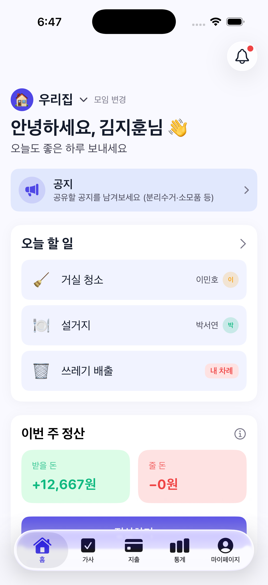
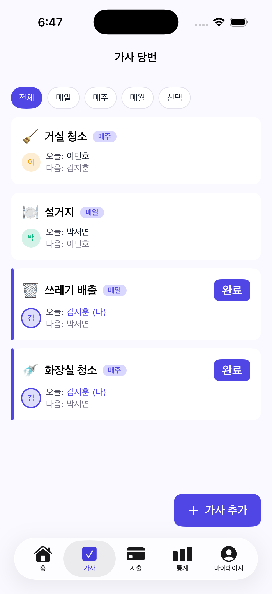
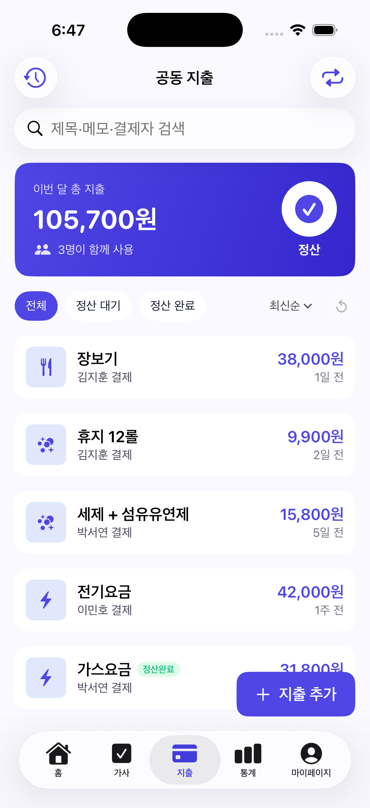
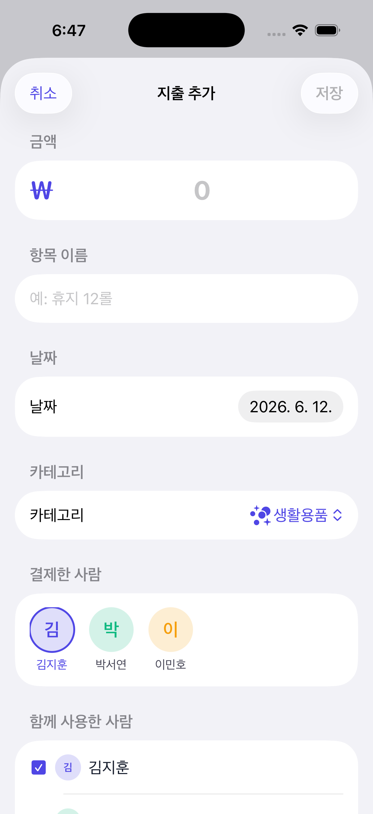
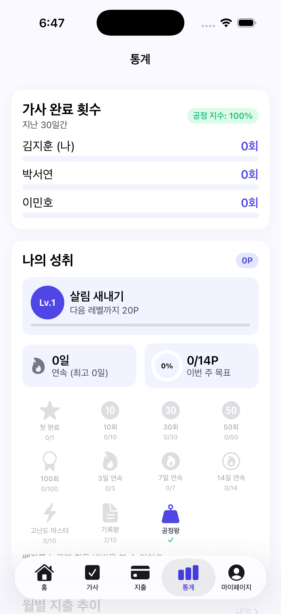

<div align="center">

# RoomieSync

> 룸메이트 가사 분담 자동 로테이션 + 공동 지출 자동 정산 iOS 앱

[](https://swift.org)
[](https://developer.apple.com/ios)
[](https://developer.apple.com/xcode)
[](https://developer.apple.com/xcode/swiftui)
[](https://developer.apple.com/documentation/swiftdata)
[](https://developer.apple.com/icloud/cloudkit)
[](LICENSE)


[📺 시연 영상 보기 (YouTube)](https://youtube.com/watch?v=PLACEHOLDER) · [📦 GitHub QR](docs/qr.png)

</div>

---

## ② 문제 정의

자취·셰어하우스 거주자 사이에서 **가사 분담 불균형** 과 **공동 지출 정산 누락** 두 갈등이 반복적으로 발생합니다. 카톡 메모는 공유는 되지만 자동화가 없고, 가계부 앱은 자동화는 있지만 공유가 없으며, 종이 당번표는 둘 다 없습니다.

> "야, 쓰레기 누구 차례야?" / "휴지 값 누가 냈더라?"

RoomieSync 는 이 두 페인을 **단 하나의 앱**에서 해결합니다. 가사는 멤버 순서대로 자동 회전, 지출은 채무 단순화 알고리즘으로 송금 횟수를 최소화. 게다가 위젯·Live Activity 로 "오늘 한 일"을 **앱을 열지 않고도** 즉시 확인할 수 있습니다.

## ③ 주요 기능

| 화면 | 기능 | 스크린샷 |
|---|---|---|
| 홈 | 오늘 할 일 + 이번 주 정산 + 분담 현황을 한 화면에 |  |
| 가사 | 멤버 순서대로 자동 배정 · 완료 시 5초 취소 토스트 후 다음 멤버로 회전 |  |
| 지출 | 카테고리별 입력 + 참여자 자동 분배 + 영수증 첨부 |  |
| 지출 추가 | 큰 ₩ 입력 + 결제자/참여자 시각적 선택 + 각자 부담 실시간 계산 |  |
| 통계 | 가사 완료 횟수 + 공정 지수 + 월별 추이 + 카테고리 도넛 + 🏆 MVP |  |

추가 차별 기능:
- **위젯 4종** — Small / Medium 홈 위젯, accessoryCircular / Inline / Rectangular 잠금화면 위젯
- **Live Activity 2종** — 가사 진행 중 + 정산 카운트다운 (Dynamic Island compact / expanded / minimal)
- **푸시 알림 5종** — 오전 당번 · 저녁 미완료 · 룸메 완료 · 지출 입력 · 월말 정산
- **CloudKit 공유** — 같은 그룹이면 모든 멤버 기기에서 실시간 동기화

## ④ 기술 스택

| 분류 | 선택 | 이유 |
|---|---|---|
| 언어 | Swift 6.0 (strict concurrency) | Xcode 26.5 번들, @Observable + @MainActor + Sendable 매크로 활용 |
| UI | SwiftUI + iOS 17 @Observable | 보일러플레이트 최소, Combine 의존 제거 |
| 영속 | SwiftData (+ CloudKit mirroring) | CoreData 대비 코드 양 절반, CloudKit 연동 1줄 |
| 동기화 | CloudKit Private + Shared DB | 서버 무구축, CKShare 로 그룹 공유 |
| 차트 | Swift Charts | 네이티브 LineMark / SectorMark, 외부 라이브러리 0 |
| 알림 | UserNotifications (Local) | APNs 인증서 불필요, 5 시나리오 모두 로컬로 가능 |
| 위젯 | WidgetKit + AppIntent | iOS 17 configurable widget + 위젯에서 직접 완료 |
| Live Activity | ActivityKit | Dynamic Island 3 레이아웃 + 잠금화면 |
| 의존성 관리 | XcodeGen (project.yml 기반) | .xcodeproj 충돌 0, 4주간 폴더 구조 변경에 유연 |

테스트: **Swift Testing** (`@Test`) 34 케이스 + parameterized (3·4·5인 정산 15 시나리오)

## ⑤ 아키텍처

**MVVM + Repository Pattern**

```
┌───────────────────────────────────────────────────┐
│ Presentation                                      │
│  SwiftUI Views (5 화면) + @Observable ViewModels  │
└─────────────────────────┬─────────────────────────┘
                          │ async/await
┌─────────────────────────▼─────────────────────────┐
│ Domain                                            │
│  Group · Member · Chore · Expense · Settlement    │
│  SettlementCalculator (그리디 매칭)                 │
│  ChoreRotation · ConflictResolver                 │
└─────────────────────────┬─────────────────────────┘
                          │ protocol
┌─────────────────────────▼─────────────────────────┐
│ Repository (3 protocol + 6 구현체)                 │
│  SwiftData (운영) ↔ InMemory (테스트 / Preview)     │
└─────────────────────────┬─────────────────────────┘
                          │
┌─────────────────────────▼─────────────────────────┐
│ Platform Services                                 │
│  CloudKit · UserNotifications · WidgetKit         │
│  ActivityKit · HapticManager · NetworkMonitor     │
└───────────────────────────────────────────────────┘
```

폴더 트리:

```
roomiesync/
├── README.md (이 파일)
├── LICENSE (MIT)
├── project.yml (XcodeGen)
├── docs/
│   ├── progress.md           (주차별 진척 로그)
│   ├── cloudkit-setup.md     (CloudKit 설정 가이드)
│   ├── video-script.md       (3분 시연 영상 콘티)
│   ├── handoff.md            (제출 전 체크리스트)
│   └── screens/              (시뮬레이터 스크린샷 5장)
├── RoomieSync/
│   ├── App/                  (@main, RootView, MainTabView)
│   ├── Features/             (Group / Chore / Expense / Stats / Home / Onboarding / Settings)
│   ├── Core/
│   │   ├── Domain/           (Pure Swift struct 6 종)
│   │   ├── Repository/       (Protocol + SwiftData + InMemory)
│   │   ├── Services/         (Settlement / Rotation / Conflict / Notification / CloudKit ...)
│   │   ├── Shared/           (위젯 ↔ 메인앱 AppGroup DTO)
│   │   └── UI/               (DesignSystem + 5 공통 컴포넌트)
│   ├── Widget/               (WidgetKit Extension)
│   ├── LiveActivity/         (ActivityKit — Widget Extension 안에서)
│   └── Resources/            (Localizable.strings · Assets.xcassets)
├── RoomieSyncTests/          (Swift Testing 34 케이스)
└── .github/workflows/ci.yml  (GitHub Actions — macos-latest)
```

## ⑥ 빌드 방법

### 사전 조건

- macOS Tahoe 26.4.1 이상
- Xcode 26.5 (Swift 6.3 번들, iOS 17 SDK 포함)
- Apple ID (Personal Team 또는 Developer Program)
- Homebrew (XcodeGen 설치용)

### 빌드 4단계

```bash
# 1. XcodeGen 설치 (최초 1회)
brew install xcodegen

# 2. 리포지토리 클론
git clone https://github.com/eomminwook/roomiesync.git
cd roomiesync

# 3. Xcode 프로젝트 생성
xcodegen generate

# 4. 열기 + 실행
open RoomieSync.xcodeproj
```

Xcode 에서:
1. RoomieSync 타깃 → **Signing & Capabilities** → Team 본인 Apple ID 선택
2. CloudKit 컨테이너 설정 → 자세한 가이드는 [`docs/cloudkit-setup.md`](docs/cloudkit-setup.md) 참조
3. `⌘B` 빌드, `⌘U` 테스트 (34 케이스 PASS 기대), `⌘R` 실행

## ⑦ 핵심 알고리즘 — 채무 단순화 (Debt Simplification)

각 멤버의 순잔액 (받을 돈 − 줄 돈) 을 계산한 뒤 그리디 매칭으로 채권자·채무자를 연결하여 송금 횟수를 최소화. 최악의 경우 **N-1** 번 송금으로 정산 종료.

### 의사 코드

```
function calculate(expenses, members):
    # 1. 각 멤버 net_balance = (받을 돈) - (줄 돈)
    net = {}
    for e in expenses:
        net[e.paidBy] += e.amount
        for p in e.participants:
            net[p] -= e.amount / len(e.participants)

    # 2. 양수 큐(채권자), 음수 큐(채무자) 분리·정렬
    creditors = sorted([(m, b) for m, b in net if b > 0], desc=b)
    debtors   = sorted([(m, -b) for m, b in net if b < 0], desc=b)

    # 3. 두 큐의 head 끼리 min(|채권|, |채무|) 매칭
    settlements = []
    while creditors and debtors:
        c = creditors[0]; d = debtors[0]
        pay = min(c.amount, d.amount)
        settlements.append(Settlement(from=d.member, to=c.member, amount=pay))
        c.amount -= pay
        d.amount -= pay
        if c.amount == 0: creditors.pop(0)   # 4. 0 이 된 쪽 제거
        if d.amount == 0: debtors.pop(0)

    return settlements
```

### 입출력 예시

**입력**: 3 인 그룹, 5 건 지출
```
김지훈 결제: 휴지 9,900 (3명 참여)
박서연 결제: 세제 15,800 (3명)
이민호 결제: 전기요금 42,000 (3명)
박서연 결제: 가스요금 31,800 (3명)
김지훈 결제: 장보기 38,000 (3명)
```

총 합 137,500원 ÷ 3명 = 1인당 부담 45,833원 (소수점 절사).

각자 결제한 금액:
- 김지훈: 9,900 + 38,000 = 47,900원
- 박서연: 15,800 + 31,800 = 47,600원
- 이민호: 42,000원

**net_balance** (결제 − 부담):
- 김지훈: 47,900 − 45,833 = **+2,067**
- 박서연: 47,600 − 45,833 = **+1,767**
- 이민호: 42,000 − 45,833 = **−3,833**

합계 +1원 (KRW 단위 절사로 인한 1원 잔차 — `SettlementCalculator` 가 epsilon 0.01 로 흡수). 자세한 invariant 검증은 `RoomieSyncTests/SettlementCalculatorTests.swift` 의 15 시나리오 참조.

**출력 (그리디 매칭)**:
1. 이민호 → 김지훈 2,067원
2. 이민호 → 박서연 1,766원

3 인 그룹의 최악(단순 1:1 매칭) 3 회 송금이 **2 회** 로 단축. N 인 그룹 일반화 시 ≤ N−1 회 보장.

복잡도: O(N log N) 정렬 + O(N) 매칭. N = 멤버 수.

## ⑧ 테스트

```bash
# Xcode UI
⌘U

# 또는 CLI
xcodebuild test \
  -scheme RoomieSync \
  -destination 'platform=iOS Simulator,name=iPhone 15 Pro'
```

총 **34 케이스** (Swift Testing `@Test`):
- `SettlementCalculatorTests` — 3·4·5 인 시나리오 각 5 개 (15) + edge 2
- `RotationTests` — round-robin / swap / 멤버 추가/제거 / wrap-around (7)
- `ConflictResolverTests` — last-write-wins / settled 우선 (4)
- `OfflineQueueTests` — flush / 실패 중단·재시도 (3)
- `CKErrorMapperTests` — network/quota/conflict/notAuthenticated (5)

CI 가 PR 마다 자동 빌드 + 테스트: `.github/workflows/ci.yml`

## ⑨ 향후 계획

- **Android 버전** — Kotlin Multiplatform 으로 도메인 / 알고리즘 공유, UI 만 Jetpack Compose 로 재작성. 채무 단순화 알고리즘이 KMP target 으로 그대로 컴파일.
- **B2B 셰어하우스 운영자 대시보드** — 셰어하우스 관리자가 여러 그룹을 한 화면에서 모니터링 + 청구서 PDF 자동 생성. iPad 전용 WindowGroup 추가.
- **AI 가사 추천** — 최근 30 일 완료 로그 + 사용자 직업 패턴으로 가사 종류 / 주기 추천. Apple Intelligence + on-device CoreML 활용.
- **결제 PG 직접 연동** — 토스 / 카카오페이 외에 신한 송금 API 연동 검토.

## ⑩ 라이선스 & 연락

[MIT License](LICENSE) — 자유로운 사용, 수정, 배포 가능.

- 작성자: **엄민욱** (학번 2091188)
- 소속: 한성대학교 컴퓨터공학
- 과목: iOS 프로그래밍 기말 미니프로젝트
- 제출일: 2026-06-14
- 이메일: gwangonair@gmail.com

> 학기 중 만든 학생 프로젝트입니다. 버그 리포트 / 개선 제안 환영 — GitHub Issues 로 남겨주세요.
