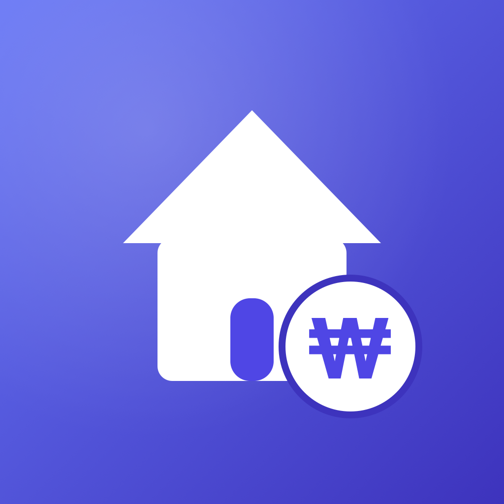

<div align="center">

# RoomieSync

### 룸메이트 가사 분담 자동 로테이션 · 공동 지출 자동 정산 iOS 앱

iOS 프로그래밍 기말 미니프로젝트

한성대학교 IT공과대학 엄민욱 (2091188)

</div>

---

## 프로젝트 목적

#### 정의

* 자취·셰어하우스 룸메이트가 **가사 당번**과 **공동 지출 정산**을 한 앱에서 관리하는 모바일 서비스이다.
* 가사는 멤버 순서대로 자동 회전하고, 지출은 채무 단순화 알고리즘으로 송금 횟수를 최소화한다.

#### 배경

* 룸메이트 사이의 갈등은 대부분 "당번이 누구인지", "누가 무엇을 결제했는지"가 명확하지 않아 발생한다.
* 카카오톡 메모는 공유는 되지만 자동화가 없고, 가계부 앱은 자동화는 있지만 공유가 안 되며, 종이 당번표는 둘 다 없다.
* 두 문제를 동시에 해결하면서 "앱을 열지 않아도" 오늘 할 일을 확인할 수 있는 서비스가 필요했다.

#### 목표

* 가사 당번을 날짜 기준으로 **자동 배정·회전**하여 분담 불균형을 없앤다.
* 공동 지출을 입력하면 정산 금액과 송금 대상을 **자동 계산**하여 정산 누락을 없앤다.
* 위젯·잠금화면·알림으로 정보를 **수동적으로(앱 미실행 상태에서도)** 전달한다.
* 같은 그룹 멤버끼리 데이터가 **실시간 동기화**되되, 다른 그룹과는 **격리**되도록 한다.

---

## 프로젝트 개요

#### 서비스 설명

| 화면 | 주요 기능 |
|---|---|
| 홈 | 모임 전환 · 공지 배너 · 오늘 할 일 · 이번 주 정산 · 가사 분담 현황을 한 화면에 요약 |
| 가사 | 멤버 순서대로 자동 배정 · 주기(매일/매주/매월/한 번)·난이도 설정 · 담당자·회전 순서 직접 지정 · 날짜가 지나면 다음 멤버로 회전 |
| 지출 | 카테고리별 입력 · 참여자 자동/직접 분배 · 검색·정렬 · 정산 대기/완료 필터 |
| 지출 추가 | 금액·항목·날짜·카테고리 입력 + 결제자·참여자 시각적 선택 + 각자 부담 실시간 계산 |
| 통계 | 가사 완료 횟수 · 공정 지수(난이도 가중) · 월별 추이 · 카테고리 도넛 · MVP · 레벨·뱃지 |

부가 기능

* **정산 자동화** — 채무 단순화로 송금 횟수 최소화, 토스·카카오페이 등 송금 앱 딥링크/계좌 복사, 송금 요청 알림, 정산 히스토리
* **인앱 알림함** — 송금 요청·완료·새 지출·새 가사·공지를 한 곳에 모아보기(스와이프/전체 삭제, 탭 시 해당 화면 이동)
* **반복 지출** — "관리비 매월 25일" 같은 고정 지출을 템플릿으로 자동 생성
* **공지 보드** — 그룹 공유 공지(고정/삭제), 새 공지 시 홈 배너 강조 + 알림
* **게이미피케이션** — 난이도 가중 포인트 기반 레벨/타이틀, 연속 달성, 주간 목표, 진행형 뱃지
* **멀티 그룹** — 초대 코드로 합류(최대 6인), 여러 모임 전환, 그룹별 데이터 격리
* **위젯·Live Activity** — 홈/잠금화면 위젯 4종(위젯에서 바로 완료), Dynamic Island Live Activity 2종
* **로컬 알림 7종** — 오전 당번·저녁 미완료·룸메 완료·지출 입력·새 가사·새 공지·송금 요청

#### 시스템 구조

MVVM + Repository 패턴으로, 도메인 로직은 백엔드 구현에 의존하지 않고 동일 프로토콜의 세 가지 구현(InMemory / SwiftData / Firestore)을 런타임에 주입한다.

```
┌───────────────────────────────────────────────┐
│ Presentation : SwiftUI View + @Observable VM   │
└───────────────────────┬───────────────────────┘
                        │ async / await
┌───────────────────────▼───────────────────────┐
│ Domain : Group·Member·Chore·Expense·Settlement │
│  SettlementCalculator · ChoreRotation 등 순수   │
└───────────────────────┬───────────────────────┘
                        │ Repository Protocol × 3
┌───────────────────────▼───────────────────────┐
│ Repository : InMemory · SwiftData · Firestore  │
└───────────────────────┬───────────────────────┘
                        │
┌───────────────────────▼───────────────────────┐
│ Platform : Firebase · UserNotifications ·      │
│  WidgetKit · ActivityKit · Haptic              │
└───────────────────────────────────────────────┘
```

핵심 알고리즘 — **채무 단순화(Debt Simplification)**: 각 멤버의 순잔액(받을 돈 − 줄 돈)을 구한 뒤, 채권자·채무자 큐를 그리디 매칭하여 송금 횟수를 최소화한다. N인 그룹에서 최악의 경우에도 **N−1회** 송금으로 정산이 끝난다. 시간 복잡도는 정렬 O(N log N) + 매칭 O(N).

#### 구현 결과

<table>
  <tr>
    <td align="center" width="33%"><br/><br/><b>홈</b><br/>오늘 할 일·정산 요약</td>
    <td align="center" width="33%"><br/><br/><b>가사</b><br/>자동 배정·날짜 기준 회전</td>
    <td align="center" width="33%"><br/><br/><b>지출</b><br/>입력·검색·정산 필터</td>
  </tr>
  <tr>
    <td align="center"><br/><br/><b>지출 추가</b><br/>결제자·참여자 선택, 부담 실시간 계산</td>
    <td align="center"><br/><br/><b>통계</b><br/>공정 지수·레벨·뱃지</td>
    <td></td>
  </tr>
</table>

#### 기대 효과

* "당번이 누구냐", "누가 결제했냐"는 반복 갈등을 데이터로 대체한다.
* 정산 송금 횟수가 최소화되어 정산 과정의 번거로움이 줄어든다.
* 위젯·알림으로 앱을 열지 않아도 오늘의 할 일과 정산 현황을 인지할 수 있다.

---

## 관련 기술

| 분류 | 설명 |
|---|---|
| 언어 | Swift 6.0 — strict concurrency, @Observable·@MainActor·actor 기반 동시성 안전 |
| UI | SwiftUI + iOS 17 @Observable — 보일러플레이트 최소화, Combine 의존 제거 |
| 로컬 영속 | SwiftData(@Model) — CoreData 대비 코드량 절감 |
| 클라우드 동기화 | Firebase Firestore + 익명 인증 — 서버 무구축, 멤버십 기반 보안 규칙으로 그룹 격리 |
| 차트 | Swift Charts — 네이티브 LineMark / SectorMark, 외부 라이브러리 미사용 |
| 알림 | UserNotifications(Local) — APNs 인증서 불필요, 7개 시나리오 + 알림 액션·라우팅 |
| 위젯 / Live Activity | WidgetKit + AppIntent, ActivityKit — 위젯에서 직접 완료, Dynamic Island |

## 개발 도구

| 분류 | 설명 |
|---|---|
| IDE | Xcode 26.5 (Swift 6, iOS 17 SDK) |
| 프로젝트 생성 | XcodeGen(project.yml) — .xcodeproj 충돌 방지, 폴더 구조 변경에 유연 |
| 의존성 관리 | Swift Package Manager — firebase-ios-sdk |
| 백엔드 콘솔 | Firebase Console — Authentication(익명), Firestore Database, 보안 규칙 |
| 형상 관리 | Git / GitHub — 기능별 브랜치 + main 통합 |
| 테스트 | Swift Testing(@Test) — 정산·로테이션·충돌해결·오프라인큐 단위 테스트 |

#### 빌드 방법

```bash
brew install xcodegen                       # 최초 1회
git clone https://github.com/KOREMW/RoomieSync.git
cd RoomieSync
# Firebase 콘솔에서 받은 GoogleService-Info.plist 를 RoomieSync/ 에 배치 (.gitignore 처리됨)
xcodegen generate
open RoomieSync.xcodeproj                    # ⌘R 실행
```

> `GoogleService-Info.plist` 가 없으면 Firebase 는 비활성화되고 앱은 로컬(SwiftData) 백엔드로 동작한다. Firebase 설정·보안 설계 상세는 [`docs/firebase-setup.md`](docs/firebase-setup.md) · [`docs/security.md`](docs/security.md) 참조.

---

## 발표 영상

아래 이미지를 클릭하면 3분 시연 영상으로 이동합니다.

<div align="center">

[](https://youtu.be/Lx0CKEFAxxU)

</div>

---

<div align="center">

[MIT License](LICENSE) · 작성자 **엄민욱 (2091188)** · 한성대학교 IT공과대학

</div>
